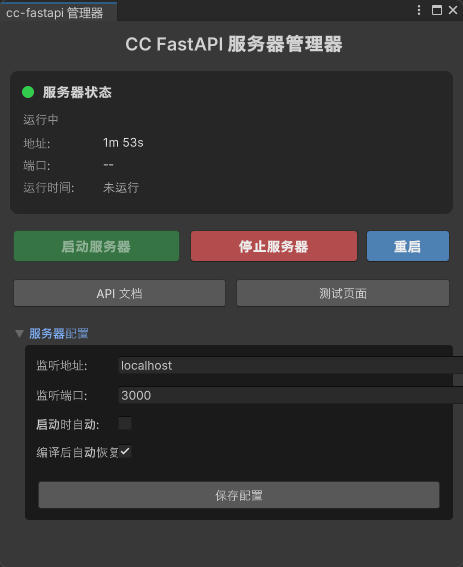
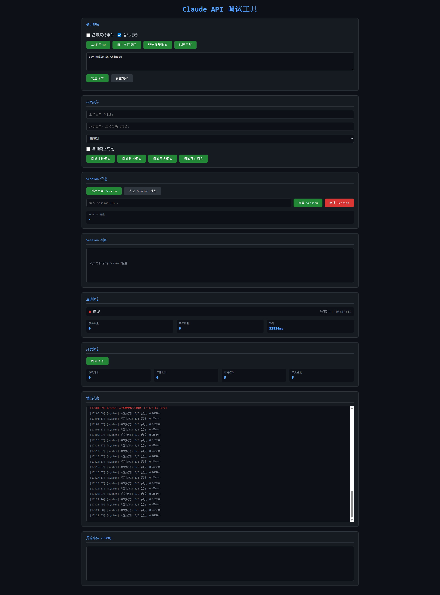
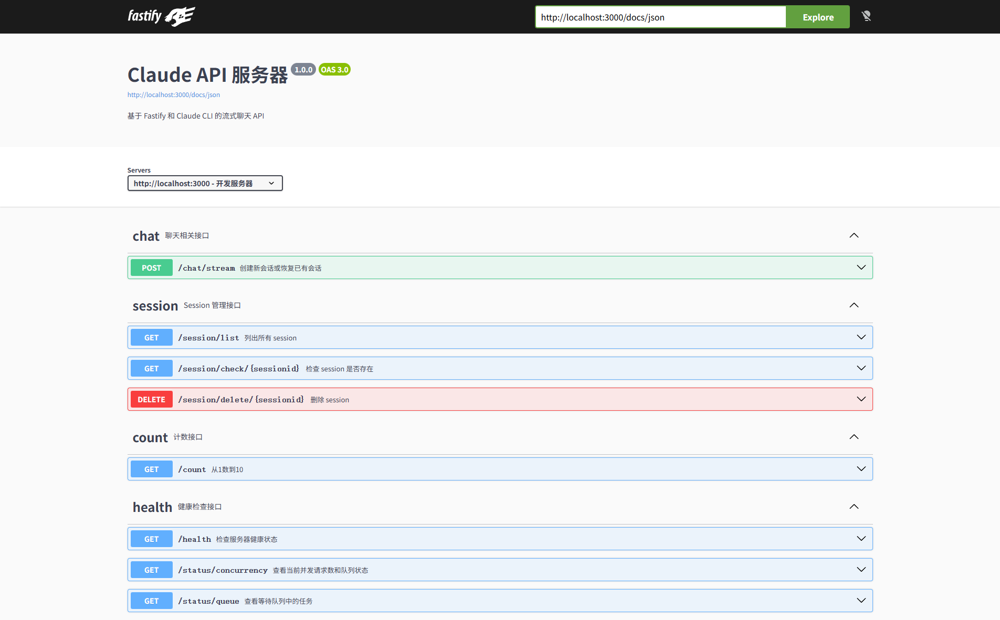

# com.kiff.cc-fastapi

Claude Code CLI 中转 API 服务器 - Unity 集成包

## 界面预览

### Unity 管理器窗口



### Claude API 聊天界面



### Swagger API 文档



## 快速开始

### 安装

在 Unity 项目的 `Packages/manifest.json` 中添加：

```json
{
  "dependencies": {
    "com.kiff.cc-fastapi": "https://github.com/mickorz/unity-cc-fastapi.git"
  }
}
```

或使用特定版本：

```json
{
  "dependencies": {
    "com.kiff.cc-fastapi": "https://github.com/mifforz/unity-cc-fastapi.git#v1.0.0"
  }
}
```

### 前置要求

1. **Node.js** - 下载安装 [Node.js](https://nodejs.org/)（v16 或更高版本）
2. **Claude CLI** - 确保系统已安装 Claude Code CLI

### 使用步骤

1. 打开 Unity 编辑器
2. 菜单栏选择 `Tools > cc-fastapi > 管理器`
3. 点击"启动服务器"按钮
4. 等待首次依赖安装（仅第一次需要）
5. 服务器启动成功

## 功能特性

- **一键启动/停止** - 在 Unity 编辑器内直接控制服务器
- **流式聊天 API** - 基于 SSE 协议的实时响应
- **会话管理** - 支持会话创建、恢复、查询、删除
- **权限控制** - 支持多种权限模式
- **并发限制** - 内置请求队列和并发控制
- **自动部署** - 首次使用自动安装依赖

## 管理器窗口

### 打开方式

```
菜单: Tools > cc-fastapi/管理器
```

### 窗口功能

| 功能 | 说明 |
|------|------|
| 状态卡片 | 显示服务器运行状态、地址、端口、运行时间 |
| 启动按钮 | 启动 cc-fastapi 服务器 |
| 停止按钮 | 停止正在运行的服务器 |
| 重启按钮 | 重启服务器 |
| API 文档 | 在浏览器中打开 Swagger 文档 |
| 测试页面 | 在浏览器中打开测试调试页面 |
| 服务器配置 | 配置服务器参数（地址、端口、自动启动等）|

## API 接口简介

### 基础信息

- **默认地址**: `http://localhost:3000`
- **API 文档**: `http://localhost:3000/docs`

### 主要接口

| 接口 | 方法 | 说明 |
|------|------|------|
| `/chat/stream` | POST | 流式聊天接口 |
| `/session/list` | GET | 获取会话列表 |
| `/session/check/:id` | GET | 检查会话是否存在 |
| `/session/delete/:id` | DELETE | 删除会话 |
| `/health` | GET | 健康检查 |
| `/status/concurrency` | GET | 并发状态 |

### 聊天接口示例

```json
POST /chat/stream
{
    "prompt": "帮我创建一个 C# 脚本",
    "workspace": "D:/MyProject",
    "allowedmode": "projectwrite"
}
```

### 权限模式说明

| 模式 | 说明 |
|------|------|
| pure | 纯粹模式，无特殊权限 |
| simple | 允许联网 |
| readonly | 只读模式，不能修改文件 |
| projectwrite | 工程可写模式 |

## 配置说明

### 管理器配置

在管理器窗口中可以配置：

| 配置项 | 说明 | 默认值 |
|--------|------|--------|
| 监听地址 | 服务器监听的地址 | localhost |
| 监听端口 | 服务器监听的端口 | 3000 |
| 自动启动 | Unity 启动时自动启动服务器 | false |

### 环境变量

在 `Runtime/cc-fastapi/.env` 文件中配置：

```env
# 工作目录
WORKING_DIR=./workspace

# Anthropic API 密钥
ANTHROPIC_API_KEY=your_api_key_here

# 服务器配置
PORT=3000
HOST=0.0.0.0

# CORS 配置
CORS_ORIGIN=*

# 并发限制
MAX_CONCURRENT=3
```

## 目录结构

```
Packages/com.kiff.cc-fastapi/
├── package.json              # Unity Package 清单
├── README.md                 # 本文档
├── Runtime/                  # Node.js 运行时
│   └── cc-fastapi/
│       ├── src/              # TypeScript 源码
│       ├── dist/             # 编译后的 JS
│       └── package.json      # Node.js 配置
├── Editor/                   # Unity 编辑器代码
│   ├── Controllers/          # 控制器
│   ├── UI/                   # 管理窗口
│   ├── Utils/                # 工具类
│   └── Installer/            # 安装器
└── Samples/                  # 配置示例
    └── Configuration/
```

## 常见问题

### Q: 提示"未检测到 Node.js"

**A:** 请从 [Node.js 官网](https://nodejs.org/) 下载安装，安装后重启 Unity 编辑器。

### Q: 首次启动很慢

**A:** 首次启动需要安装 Node.js 依赖包，请耐心等待。后续启动会快很多。

### Q: 端口 3000 被占用

**A:** 可以在管理器窗口中修改端口配置。

### Q: 如何查看服务器日志

**A:** 日志会输出到 Unity Console，前缀为 `[CcFastApi]`。

### Q: 服务器启动失败

**A:** 请检查：
1. Node.js 是否正确安装
2. 端口是否被占用
3. Claude CLI 是否可用

## 技术支持

- **问题反馈**: [GitHub Issues](https://github.com/mickorz/unity-cc-fastapi/issues)
- **在线文档**: [项目文档](https://github.com/mickorz/unity-cc-fastapi)

## 许可证

MIT License

## 相关链接

- [Claude Code 官网](https://claude.ai/code)
- [Fastify 文档](https://www.fastify.io/docs/latest/)
- [Unity Package Manager](https://docs.unity3d.com/Manual/Packages.html)
